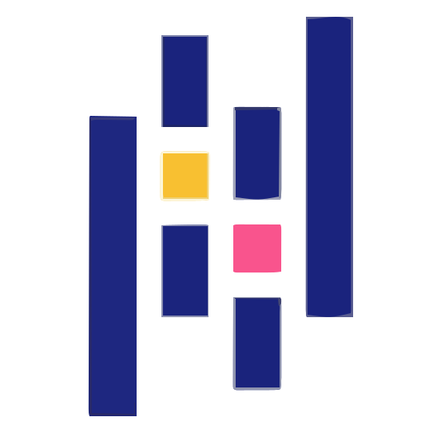
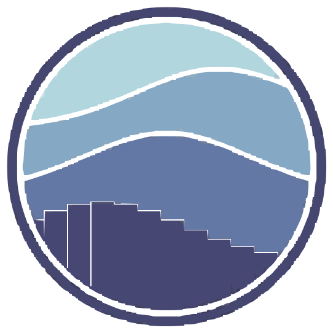

  

# 
# Lance Adrian Acal | Exploring AI, ML, and Intelligent Development

### About Me  
Hi there! I'm **Lance Adrian Acal**, a **Computer Science student at Cavite State University - Imus** with current experience in **data science** and analytics.

I do not have hands-on experience in ML or AI engineering yet, but those are my long-term goals. For now, I focus on strengthening fundamentals, building practical projects, and improving my workflow through **AI-assisted development**. I'm also actively interested in **prompt engineering** and how to design effective prompts for real workflows.

### My Focus Areas  
- **Data Science Practice** - Applying my current experience in data science and analytics to practical projects.  
- **ML and AI Learning Path** - Building foundations now as preparation for future ML or AI engineering roles.  
- **AI-Assisted Development** - Improving development speed with AI tools while keeping strong technical fundamentals.  
- **Prompt Engineering** - Crafting and iterating prompts to improve output quality, reliability, and workflow efficiency.  
- **Python for Intelligent Systems** - Using Python and core data libraries as a foundation for ML and AI workflows.  

### Tech Stack  

  
  
  
  
  
  
  
  
  
  

  Python | SQL | Excel | Power BI | R | Git | Pandas | NumPy | Matplotlib | Seaborn

## Connect With Me  

  
  
  
  

